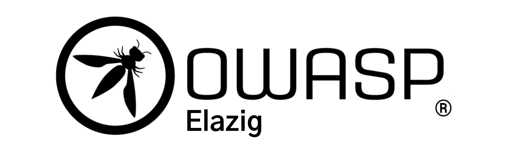

---

layout: col-sidebar
title: OWASP Elazig
tags: owaspmsku
region: Asia
meetup-group: owasp-elazig-chapter

---

## Welcome
Welcome to OWASP Elazig. We will be happy to see you if you join us! Thanks to the informatics departments at Fırat University, which it hosts, Elazig meets the cyber security specialist needs of Turkey. As OWASP Elazig, we organise Meetups, conferences, professional speaker series, workshops and inspiring presentations about Cyber Security.

## Chapter Information
OWASP Elazig was established in September 2022 as a city society. The first meeting with Cyber Security Fundamentals and OWASP Introduction will be held on 19 September 2022. As OWASP Elazig, we continue free and open meetings that focus on content that participants can implement in their own environment.

Keep watching this space for announcements about upcoming events. Everyone is welcome to join us at our chapter meetings. For more detailed information about the OWASP Elazig Chapter, contact the chapter leaders:

 - [Deniz Bektaş](mailto:deniz.bektas@owasp.org)
 - [Muhammed Batuhan Aydın](mailto:muhammed.aydin@owasp.org)
 - [Berfin Yaşar](mailto:berfin.yasar@owasp.org)

Next Meeting/Event <!-- You should keep this section as it will populate your meetup events -->
---------------------


## Benefits of Attending Meetings
-   Networking
-   Cyber Security knowledge sharing
-   Gaining different perspectives
-   Have fun!

## Membership
The Open Web Application Security Project (OWASP) is a nonprofit foundation that works to improve the security of software. All of our projects, tools, documents, forums, and chapters are free and open to anyone interested in improving application security.

Chapters are led by local leaders in accordance with the  [Chapters Policy](https://owasp.org/www-policy/operational/chapters). Financial contributions should only be made online using the authorized online donation button.

-   Everyone is welcome and encouraged to participate in our  [Projects](https://owasp.org/projects/),  [Local Chapters](https://owasp.org/chapters/),  [Events](https://owasp.org/events/),  [Online Groups](https://groups.google.com/a/owasp.com/), and  [Community Slack Channel](https://owasp.slack.com/).We especially encourage diversity in all our initiatives.
-   OWASP is a fantastic place to learn about application security, to network, and even to build your reputation as an expert.
-   We also encourage you to be  [become a member](https://owasp.org/membership/)  or consider a  [donation](https://owasp.org/donate/)  to support our ongoing work.

## Supporters
OWASP finances the projects and its organization through sponsors. A sponsor sustainably supports the work of OWASP. You have two options - which you can also use both in parallel - to support OWASP. We would be very happy about that:

-   Become an  [OWASP Corporate Supporter](https://owasp.org/supporters/)
-   Support the chapter as an  [OWASP Elazig Chapter Supporter](https://owasp.org/donate/?reponame=www-chapter-elazig&title=OWASP+Elazig+Chapter)

In particular, please take note of the  [OWASP Donations Policy](https://owasp.org/www-policy/operational/donations).

## Presentations and Professional Speakings
If you like to speak on our upcoming events, please review the  [speaker agreement](https://owasp.org/www-policy/legal/speaker-agreement)  and kindly email us  [Deniz Bektas](mailto://deniz.bektas@owasp.org),  [Muhammed Batuhan Aydın](mailto://muhammed.aydin@owasp.org)  &  [Berfin Yaşar](mailto://berfin.yasar@owasp.org)
